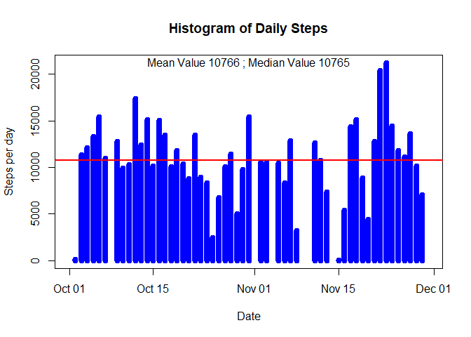
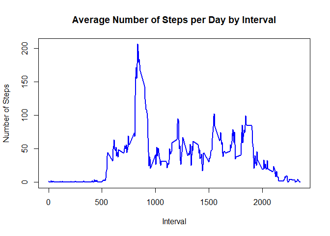
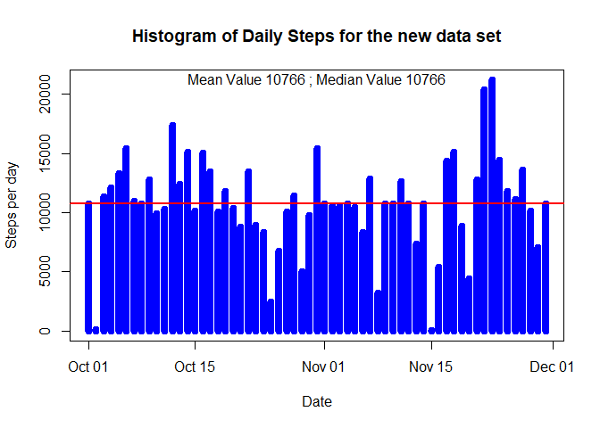
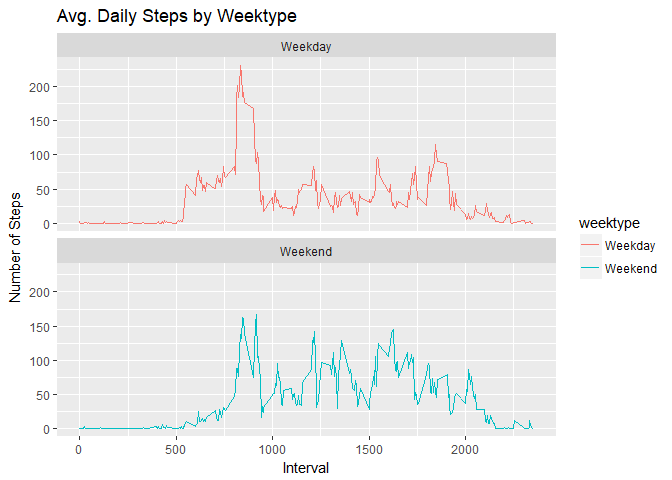

## Loading and preprocessing the data

```r
library(dplyr)  
```

```
## Warning: package 'dplyr' was built under R version 3.4.3
```

```
## 
## Attaching package: 'dplyr'
```

```
## The following objects are masked from 'package:stats':
## 
##     filter, lag
```

```
## The following objects are masked from 'package:base':
## 
##     intersect, setdiff, setequal, union
```

```r
library(ggplot2)  
setwd("C:\\Malathi\\Coursera\\RepData_PeerAssessment1")  
actdata <- read.csv("activity.csv")
```


## What is mean total number of steps taken per day?

```r
StepsPerDay <- summarise(group_by(actdata, date), steps=sum(steps))
StepsPerDay$date <- as.Date(StepsPerDay$date)
rmean <- mean(StepsPerDay$steps,na.rm = TRUE)
rmedian <- median(StepsPerDay$steps,na.rm = TRUE)
plot(StepsPerDay$date, StepsPerDay$steps, type="h", main="Histogram of Daily Steps", xlab="Date", ylab="Steps per day", col="blue",lwd=8)
abline(h=rmean, col="red", lwd=2)
text(x=median(StepsPerDay$date),y=max(StepsPerDay$steps,na.rm = TRUE),label=(sprintf("Mean Value %d ; Median Value %d",round(rmean),round(rmedian))))
```

<!-- -->

## What is the average daily activity pattern?

```r
MeanStepsPerInterval <- summarise(group_by(actdata,interval), steps=mean(steps,na.rm = TRUE))
plot(MeanStepsPerInterval$interval,MeanStepsPerInterval$steps, type="l", xlab="Interval", ylab="Number of Steps",main="Average Number of Steps per Day by Interval",col="blue",lwd=2)
```

<!-- -->

```r
MaxSteps <- summarise(MeanStepsPerInterval,maxsteps=max(MeanStepsPerInterval$steps, na.rm = TRUE))
```

```
## Warning: package 'bindrcpp' was built under R version 3.4.3
```

```r
# Output interval that has max value 
paste('Interval with maximum steps',as.data.frame(filter(MeanStepsPerInterval,steps == MaxSteps$maxsteps))$interval)
```

```
## [1] "Interval with maximum steps 835"
```

```r
# Output max value 
paste('Maximum interval mean steps',MaxSteps)
```

```
## [1] "Maximum interval mean steps 206.169811320755"
```

## Imputing missing values

```r
# Calculate numbers of rows in activity data set with missing values
sum(is.na(actdata$steps))
```

```
## [1] 2304
```

```r
# Replace the missing values with mean values of the interval
actnewdata <- transform(actdata, steps = ifelse(is.na(actdata$steps), MeanStepsPerInterval$steps[match(actdata$interval, MeanStepsPerInterval$interval)], actdata$steps))
# Total steps per day for the merged data set
StepsPerDayNew <- summarise(group_by(actnewdata, date), steps=sum(steps))
StepsPerDayNew$date <- as.Date(StepsPerDayNew$date)
rmeanNew <- mean(StepsPerDayNew$steps)
rmedianNew <- median(StepsPerDayNew$steps)
plot(StepsPerDayNew$date, StepsPerDayNew$steps, type="h", main="Histogram of Daily Steps for the new data set", xlab="Date", ylab="Steps per day", col="blue",lwd=8)
abline(h=rmean, col="red", lwd=2)
text(x=median(StepsPerDayNew$date),y=max(StepsPerDayNew$steps,na.rm = TRUE),label=(sprintf("Mean Value %d ; Median Value %d",round(rmeanNew),round(rmedianNew))))  
```

<!-- -->

```r
#### Orginial mean and median is 10766.19 and 10765, new data set mean and median is 10766.19 and 10766.19. Since the missing values were replaced with mean values the new mean and median are the same.
```

## Are there differences in activity patterns between weekdays and weekends?

```r
head(actnewdata)
```

```
##       steps       date interval
## 1 1.7169811 2012-10-01        0
## 2 0.3396226 2012-10-01        5
## 3 0.1320755 2012-10-01       10
## 4 0.1509434 2012-10-01       15
## 5 0.0754717 2012-10-01       20
## 6 2.0943396 2012-10-01       25
```

```r
actnewdata$date <- as.Date(actnewdata$date)
actnewdata<- actnewdata%>%
        mutate(weektype= ifelse(weekdays(actnewdata$date)=="Saturday" | weekdays(actnewdata$date)=="Sunday", "Weekend", "Weekday"))
MeanStepsByWeektype <- summarise(group_by(actnewdata,interval,weektype), steps=mean(steps,na.rm = TRUE))
plot<- ggplot(MeanStepsByWeektype, aes(x =interval , y=steps, color=weektype)) +
       geom_line() +
       labs(title = "Avg. Daily Steps by Weektype", x = "Interval", y = "Number of Steps") + facet_wrap(~weektype, ncol = 1, nrow=2)
print(plot)
```

<!-- -->

```r
#### Individual activity is high during earlier in the day on weekdays. Individual is more active throughout the weekend. 
```

